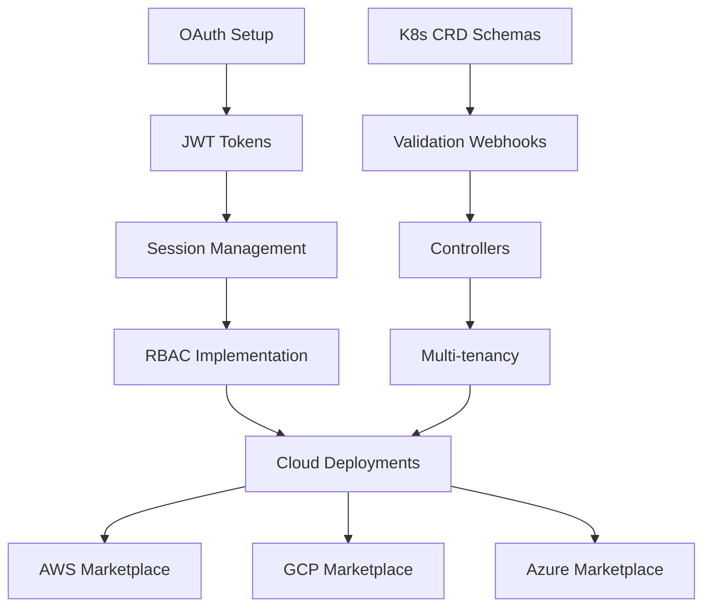

# Kloudlite v2 - Critical Tasks Summary

## ✅ Coverage Audit Results

### 1. 🔐 OAuth & Authentication - COVERED
**Existing Tasks:**
- Security: SSO with SAML/OIDC support
- Security: Multi-factor authentication

**Added Critical Tasks:**
- ✅ OAuth 2.0 providers (Google, GitHub, Microsoft)
- ✅ Device flow authentication for CLI
- ✅ JWT token management with refresh tokens
- ✅ API key authentication for service accounts
- ✅ Session management and concurrent login limits

### 2. ☁️ Cloud Provider Installation - COVERED
**Existing Tasks:**
- Infrastructure: AWS EKS deployment with Terraform
- Infrastructure: GCP GKE deployment automation
- Infrastructure: Azure AKS deployment templates
- Infrastructure: DigitalOcean Kubernetes deployment
- Infrastructure: Terraform modules for all providers

**Added Critical Tasks:**
- ✅ AWS: Complete EKS installation with VPC, IAM, and networking
- ✅ AWS: CloudFormation templates and quick-start
- ✅ GCP: Complete GKE installation with VPC and IAM
- ✅ GCP: Deployment Manager templates
- ✅ Azure: Complete AKS installation with VNet and AAD
- ✅ Azure: ARM templates and Azure Blueprints
- ✅ Automated installer script with prerequisites check
- ✅ Multi-region and high-availability setup

### 3. 👥 RBAC & Access Management - COVERED
**Existing Tasks:**
- Frontend: Team settings and permissions page
- Backend: Multi-tenant resource isolation system
- Backend: RBAC with fine-grained permissions

**Added Critical Tasks:**
- ✅ Hierarchical role system
- ✅ Custom role builder
- ✅ Resource-level permissions
- ✅ Attribute-based access control (ABAC)
- ✅ Audit trail for permission changes
- ✅ Temporary elevated privileges

### 4. 🗄️ Kubernetes CRD Persistence - COVERED
**Existing Tasks:**
- Backend: Kubernetes API data persistence using CRDs

**Added Critical Tasks:**
- ✅ Design schemas for all platform resources
- ✅ Validation and mutation webhooks
- ✅ Controllers for resource lifecycle
- ✅ Data migration and versioning
- ✅ Query layer for efficient data access

### 5. 🔌 Platform Integration - NEW
**Added Critical Tasks:**
- ✅ Kubernetes RBAC synchronization
- ✅ Service account automation
- ✅ External secret management integration
- ✅ Identity provider synchronization

---

## 📊 Task Statistics

| Category | Original | Added | Total |
|----------|----------|-------|-------|
| OAuth/Auth | 2 | 5 | **7** |
| Cloud Providers | 10 | 8 | **18** |
| RBAC/Access | 3 | 6 | **9** |
| K8s CRD Persistence | 1 | 5 | **6** |
| Platform Integration | 0 | 4 | **4** |
| **TOTAL CRITICAL** | **16** | **28** | **44** |

## 🎯 Priority Implementation Order

### Phase 1: Foundation (Week 1-2)
1. **Kubernetes CRD Persistence**
   - Design schemas for all resources
   - Implement validation webhooks
   - Create controllers

2. **Basic Authentication**
   - JWT token management
   - OAuth providers setup
   - Session management

### Phase 2: Core Platform (Week 3-4)
1. **RBAC Implementation**
   - Hierarchical role system
   - Resource-level permissions
   - Kubernetes RBAC sync

2. **Multi-tenancy**
   - Tenant isolation
   - Resource quotas
   - Namespace management

### Phase 3: Cloud Deployment (Week 5-6)
1. **AWS Deployment**
   - EKS setup with Terraform
   - CloudFormation templates
   - Marketplace preparation

2. **GCP Deployment**
   - GKE setup
   - Deployment Manager
   - Marketplace preparation

3. **Azure Deployment**
   - AKS setup
   - ARM templates
   - Marketplace preparation

### Phase 4: Production Features (Week 7-8)
1. **Advanced Security**
   - MFA implementation
   - ABAC policies
   - Audit logging

2. **Platform Integration**
   - External secret managers
   - Identity provider sync
   - Service account automation

## 🚨 Critical Path Dependencies

## ✅ Definition of Done

Each critical task must meet these criteria:
1. **Functionality** - Feature works as specified
2. **Security** - Passes security review
3. **Testing** - Unit and integration tests pass
4. **Documentation** - User and API docs complete
5. **Performance** - Meets performance targets
6. **Deployment** - Automated deployment ready

## 📈 Success Metrics

- **Authentication**: Support 10,000+ concurrent users
- **CRD Persistence**: Sub-100ms query response time
- **Cloud Deployment**: < 30 min setup time
- **RBAC**: Millisecond permission checks
- **Multi-tenancy**: 1000+ teams per cluster

## 🔗 Resources

- GitHub Project: https://github.com/orgs/kloudlite/projects/25
- Total Tasks: 129 (including 28 new critical tasks)
- Critical Path: 44 tasks for MVP
- Target: Production ready in 8 weeks

---

**Last Updated:** $(date)
**Status:** All critical areas now covered ✅