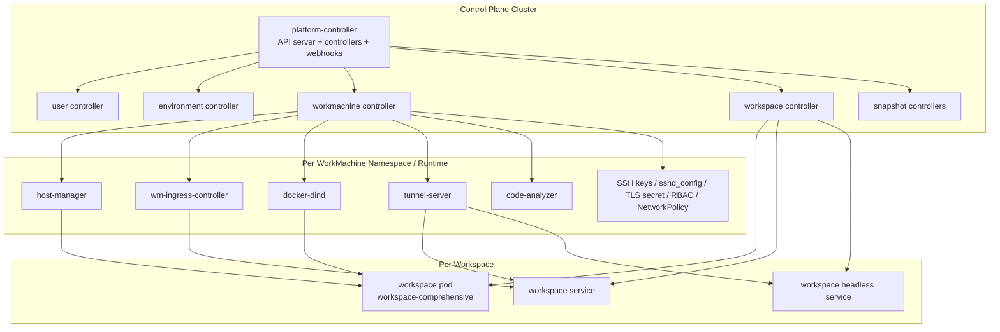

# Runtime Architecture

## Placement Summary

### Control Plane Cluster

- `platform-controller`
- user controller
- environment controller
- workmachine controller
- workspace controller
- snapshot controllers
- webhook server

### Per WorkMachine Runtime

- `host-manager`
- `wm-ingress-controller`
- `docker-dind`
- `tunnel-server`
- `code-analyzer`
- support resources: network policy, TLS secret sync, SSH host keys, `sshd_config`, RBAC

### Per Workspace

- workspace pod using `workspace-comprehensive`
- workspace service
- workspace headless service
