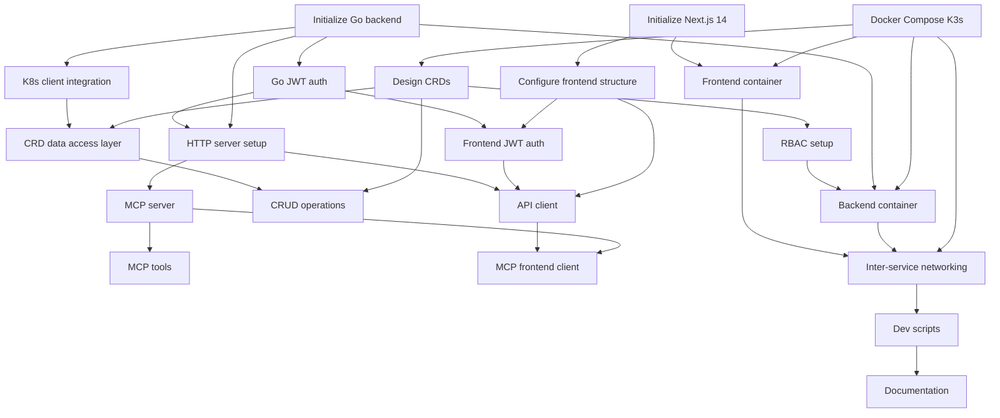

# Task Dependency Analysis - Project Setup Epic

## Dependency Graph

## Execution Phases

### Phase 1: Foundation (Parallel Execution Possible)
These tasks can be started immediately and in parallel:

**Group A - Local Environment**
1. **Task 20**: Create Docker Compose setup with K3s
   - No dependencies
   - Enables all K8s-related tasks

**Group B - Project Initialization**
2. **Task 5**: Initialize Next.js 14 project
   - No dependencies
   - Enables frontend tasks

3. **Task 9**: Initialize Go backend project
   - No dependencies
   - Enables backend tasks

### Phase 2: Core Infrastructure
After Phase 1 completes:

**Group C - Kubernetes Setup**
4. **Task 16**: Design and create CRDs
   - Depends on: Task 20 (K3s ready)

5. **Task 19**: Set up RBAC for CRD access
   - Depends on: Task 16 (CRDs exist)

**Group D - Project Structure**
6. **Task 6**: Configure frontend project structure
   - Depends on: Task 5 (Next.js initialized)

7. **Task 11**: Set up HTTP server with routing
   - Depends on: Task 9 (Go project initialized)

8. **Task 12**: Create Kubernetes client integration
   - Depends on: Task 9 (Go project initialized)

### Phase 3: Authentication & Data Layer
After Phase 2 completes:

**Group E - Authentication**
9. **Task 10**: Implement JWT authentication in Go
   - Depends on: Task 9 (Go project)
   - Depends on: Task 11 (HTTP server)

10. **Task 7**: Set up frontend authentication with JWT
    - Depends on: Task 6 (Frontend structure)
    - Depends on: Task 10 (Backend JWT ready)

**Group F - Data Access**
11. **Task 17**: Implement CRD data access layer
    - Depends on: Task 16 (CRDs created)
    - Depends on: Task 12 (K8s client)

12. **Task 18**: Create CRUD operations for CRDs
    - Depends on: Task 16 (CRDs created)
    - Depends on: Task 17 (Data access layer)

### Phase 4: Integration Layer
After Phase 3 completes:

**Group G - API Integration**
13. **Task 8**: Create API client for backend communication
    - Depends on: Task 6 (Frontend structure)
    - Depends on: Task 7 (Frontend auth)
    - Depends on: Task 11 (Backend API ready)

**Group H - MCP Integration**
14. **Task 13**: Implement MCP server in Go backend
    - Depends on: Task 11 (HTTP server)
    - Depends on: Task 10 (Authentication)

15. **Task 14**: Define MCP tools for Kloudlite operations
    - Depends on: Task 13 (MCP server)
    - Depends on: Task 18 (CRUD operations)

16. **Task 15**: Create MCP client integration for frontend
    - Depends on: Task 13 (MCP server)
    - Depends on: Task 8 (API client)

### Phase 5: Development Environment
Can run in parallel with Phase 4:

**Group I - Containerization**
17. **Task 21**: Configure backend container for local development
    - Depends on: Task 20 (K3s setup)
    - Depends on: Task 9 (Go project)
    - Depends on: Task 19 (RBAC configured)

18. **Task 22**: Set up frontend container with hot-reload
    - Depends on: Task 20 (K3s setup)
    - Depends on: Task 5 (Next.js project)

19. **Task 24**: Configure inter-service networking
    - Depends on: Task 21 (Backend container)
    - Depends on: Task 22 (Frontend container)

### Phase 6: Documentation & Tooling
Final phase after main implementation:

20. **Task 23**: Create development scripts and Makefile
    - Depends on: Task 24 (Networking complete)
    - Depends on: All container setups

21. **Task 25**: Set up development environment documentation
    - Depends on: Task 23 (Scripts created)
    - Depends on: All other tasks

## Critical Path

The longest dependency chain (critical path):
1. Task 20 (K3s setup)
2. Task 16 (Create CRDs)
3. Task 12 (K8s client) + Task 17 (Data access layer)
4. Task 18 (CRUD operations)
5. Task 14 (MCP tools)
6. Task 15 (MCP client)

**Estimated Critical Path Duration**: ~8-10 days

## Parallel Execution Opportunities

### Maximum Parallelization (3-4 developers)
- **Developer 1**: Frontend track (Tasks 5, 6, 7, 8, 22)
- **Developer 2**: Backend track (Tasks 9, 10, 11, 12, 21)
- **Developer 3**: K8s/Infrastructure (Tasks 20, 16, 17, 18, 19, 24)
- **Developer 4**: MCP & Documentation (Tasks 13, 14, 15, 23, 25)

### Minimum Team (2 developers)
- **Developer 1**: Frontend + MCP client (Tasks 5, 6, 7, 8, 15, 22)
- **Developer 2**: Backend + K8s + MCP server (Tasks 9-14, 16-21, 23-25)

## Task Dependencies Summary

| Task ID | Title | Depends On | Enables |
|---------|-------|------------|---------|
| 5 | Initialize Next.js 14 | None | 6, 22 |
| 6 | Configure frontend structure | 5 | 7, 8 |
| 7 | Frontend JWT auth | 6, 10 | 8 |
| 8 | API client | 6, 7, 11 | 15 |
| 9 | Initialize Go backend | None | 10, 11, 12, 21 |
| 10 | Go JWT auth | 9 | 7, 11, 13 |
| 11 | HTTP server setup | 9, 10 | 8, 13 |
| 12 | K8s client integration | 9 | 17 |
| 13 | MCP server | 11, 10 | 14, 15 |
| 14 | MCP tools | 13, 18 | - |
| 15 | MCP frontend client | 13, 8 | - |
| 16 | Design CRDs | 20 | 17, 18, 19 |
| 17 | CRD data access | 16, 12 | 18 |
| 18 | CRUD operations | 16, 17 | 14 |
| 19 | RBAC setup | 16 | 21 |
| 20 | Docker Compose K3s | None | 16, 21, 22, 24 |
| 21 | Backend container | 20, 9, 19 | 24 |
| 22 | Frontend container | 20, 5 | 24 |
| 23 | Dev scripts | 24 | 25 |
| 24 | Inter-service networking | 21, 22 | 23 |
| 25 | Documentation | 23 | - |