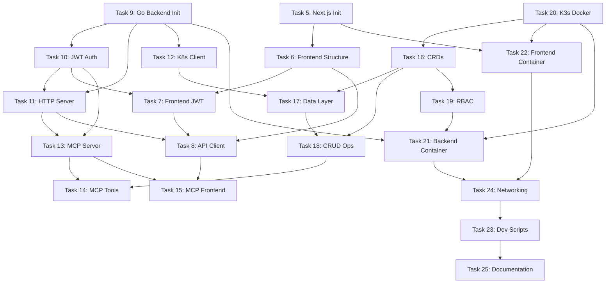

# Task Dependency Visualization - Project Setup Epic

## Dependency Statistics
- **Total Tasks**: 21
- **Total Dependencies**: 31
- **Root Tasks** (no dependencies): 3
  - Task 5: Initialize Next.js 14 project
  - Task 9: Initialize Go backend project
  - Task 20: Create Docker Compose setup with K3s

## Execution Phases

### Phase 1 - Initial Setup (Can start immediately)
**Parallel Execution:**
- **Frontend Track**: Task 5 (Next.js init)
- **Backend Track**: Task 9 (Go backend init)
- **Infrastructure Track**: Task 20 (K3s Docker setup)

### Phase 2 - Core Components
**Frontend Track:**
- Task 6 (Frontend structure) → depends on Task 5

**Backend Track:**
- Task 10 (JWT auth) → depends on Task 9
- Task 11 (HTTP server) → depends on Tasks 9, 10
- Task 12 (K8s client) → depends on Task 9

**Infrastructure Track:**
- Task 16 (CRDs) → depends on Task 20

### Phase 3 - Integration Layer
**Frontend Track:**
- Task 7 (Frontend JWT) → depends on Tasks 6, 10
- Task 22 (Frontend container) → depends on Tasks 5, 20

**Backend Track:**
- Task 13 (MCP server) → depends on Tasks 10, 11
- Task 17 (CRD data layer) → depends on Tasks 12, 16
- Task 21 (Backend container) → depends on Tasks 9, 19, 20

**Infrastructure Track:**
- Task 18 (CRUD operations) → depends on Tasks 16, 17
- Task 19 (RBAC setup) → depends on Task 16

### Phase 4 - Advanced Features
**Frontend Track:**
- Task 8 (API client) → depends on Tasks 6, 7, 11

**Backend Track:**
- Task 14 (MCP tools) → depends on Tasks 13, 18

**MCP Track:**
- Task 15 (MCP frontend) → depends on Tasks 8, 13

### Phase 5 - Final Setup
**Infrastructure:**
- Task 24 (Inter-service networking) → depends on Tasks 21, 22
- Task 23 (Dev scripts/Makefile) → depends on Task 24
- Task 25 (Documentation) → depends on Task 23

## Critical Path Analysis

The longest dependency chain (critical path) runs through:
```
Task 20 (K3s) → Task 16 (CRDs) → Task 17 (Data Layer) →
Task 18 (CRUD) → Task 14 (MCP Tools)
```

This path requires completion of:
1. K3s environment setup
2. CRD definitions
3. Data access layer implementation
4. CRUD operations
5. MCP tool definitions

## Parallel Execution Opportunities

### Maximum Parallelism by Phase:
- **Phase 1**: 3 tasks in parallel
- **Phase 2**: 4 tasks in parallel
- **Phase 3**: 5 tasks in parallel
- **Phase 4**: 3 tasks in parallel
- **Phase 5**: Sequential (1-2 tasks)

## Key Dependencies to Note

### Frontend Authentication (Task 7)
- Requires both frontend structure AND backend JWT to be complete
- This creates a cross-track dependency

### Backend Container (Task 21)
- Has 3 dependencies: Go project, K3s setup, and RBAC
- Central integration point for backend deployment

### MCP Tools (Task 14)
- Depends on both MCP server AND CRD CRUD operations
- Bridges the MCP and persistence layers

### Development Scripts (Task 23)
- Final task that depends on networking being complete
- Creates the developer experience layer

## Recommended Execution Order

1. **Start immediately (parallel):**
   - Frontend: Task 5 → 6 → 22
   - Backend: Task 9 → 10 → 11 → 13
   - Infrastructure: Task 20 → 16

2. **Once K3s is ready:**
   - Task 19 (RBAC)
   - Continue with Task 17 (Data Layer) once Task 12 is done

3. **Integration phase:**
   - Task 7 (Frontend Auth) once Task 10 is complete
   - Task 18 (CRUD) once Task 17 is complete
   - Task 21 (Backend Container) once Task 19 is complete

4. **Final phase:**
   - Task 8 → 15 (API Client → MCP Frontend)
   - Task 14 (MCP Tools)
   - Task 24 → 23 → 25 (Networking → Scripts → Docs)

## Dependency Graph Summary



## Notes

- All 31 dependencies have been successfully added to the headless-pm system
- Tasks can be started based on their dependency requirements
- The system will automatically track which tasks can start based on completed dependencies
- Use `mcp__headless-pm__can_start_task` to check if a task's dependencies are met